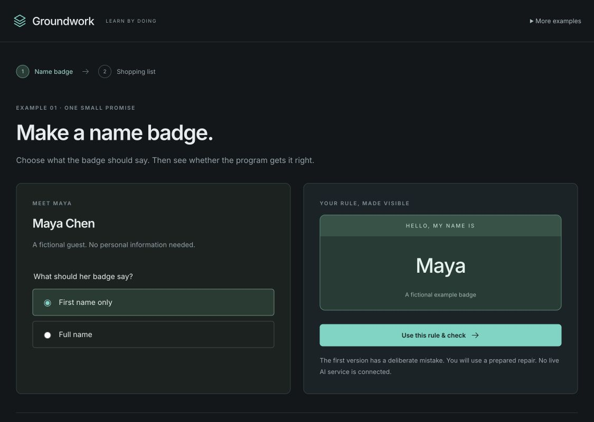
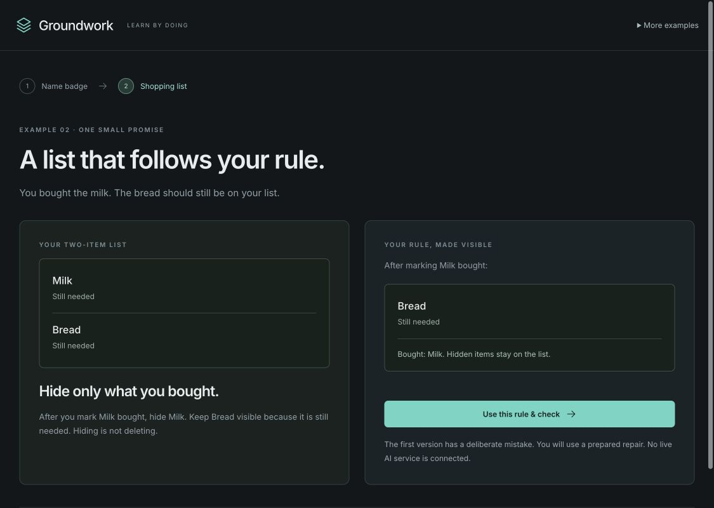

# Groundwork

**A small, local-first learning app about rules, programs, and evidence.**

Choose what a program should do, see it get something wrong, and apply a prepared repair. Then try changing the rule itself. Groundwork keeps the rule, program, check result, and your decision separate.

This is an early educational preview, not a general-purpose verifier or AI coding service.



## Try it

Use Node **24.21.0** (the version in `.nvmrc`) or another compatible version from `package.json`.

```sh
npm ci
npm run dev
```

Open the local address printed by Vite. The development server binds to loopback by default. For a production build:

```sh
npm run build
npm run preview -- --host 127.0.0.1
```

No account, API key, AI subscription, or database is needed. The app makes no application-level network requests and stores progress in your browser. Fonts are bundled through npm rather than fetched from a font CDN.

## Two beginner examples

1. **Name badge:** choose first name or full name for a fictional guest. The first program reads the wrong field. Repair it, try another guest, and optionally reconsider the naming rule.
2. **Shopping list:** buying Milk wrongly hides still-needed Bread. Repair the filter, then optionally choose to keep bought items visible.

You can finish a lesson without accepting its version or changing your preference. The original **audio queue** remains under **More examples**, or at `/?example=audio`.



## What the checks establish

- Badge: exact outputs for four supplied fictional people under the selected rule.
- Shopping: all four bought/not-bought states, four view outputs, and eight enabled transitions.
- Audio queue: finite sequential A/B reachability for capacities 1–6 and two overflow policies.

The sample and checker execute the same stored JavaScript artifact. Expected answers are evaluated separately. Results identify their rule, source, checking conditions, and scope. Earlier results stay inspectable and may become stale.

These are genuine computed checks using **prepared templates and repairs**. There is no live AI agent, arbitrary code import, independent proof kernel, or production-readiness guarantee. The runtime, generator, checker, and reference rules/tables are trusted. Data checks do not establish rendering, accessibility, concurrency, hardware timing, or correctness outside the declared domain. See [architecture and trust boundaries](docs/architecture.md).

## Your data

Progress is local to this browser and origin. Export before clearing browser data or moving to another address. Each beginner example can be restarted independently after confirmation; the audio example has its own stored session. Invalid saved data is preserved for recovery instead of silently overwritten.

Exports and source downloads are available in the app. Exported sessions are not currently importable. Browser-local history is editable and unsigned; SHA-256 identifies artifacts, not an authenticated audit trail. See [security and privacy](SECURITY.md).

## Development

```sh
npm run check
npm run verify:release
npm audit
```

`check` runs integrity tests, UI tests, production build, and Sites packaging tests. [Contributing](CONTRIBUTING.md) describes the supported workflow. [Release validation](docs/release-validation.md) distinguishes automated tests, simulated-persona UAT, and remaining gaps.

The build emits `dist/client/` for static hosting and a small Worker package in `dist/server/`. The included `.openai/hosting.json` is deliberately unconfigured. Configure your own hosting project before a Sites deployment; no deployment is performed by installation or tests.

## Status and license

Early preview: **0.1.0-rc.1**, available under the [MIT License](LICENSE). Third-party packages retain their own licenses; see [notices](THIRD_PARTY_NOTICES.md).
