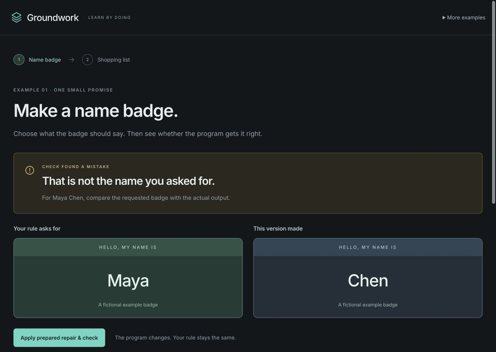
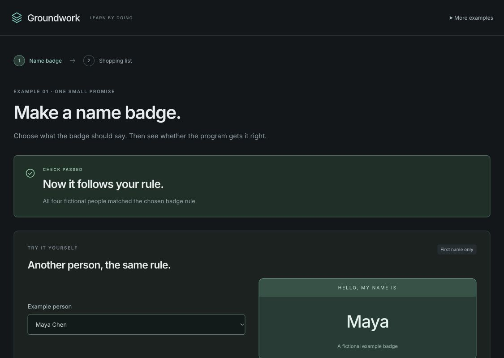
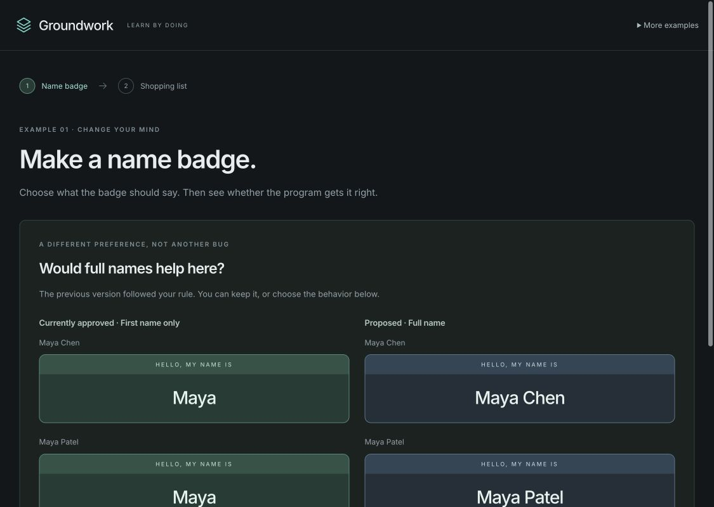
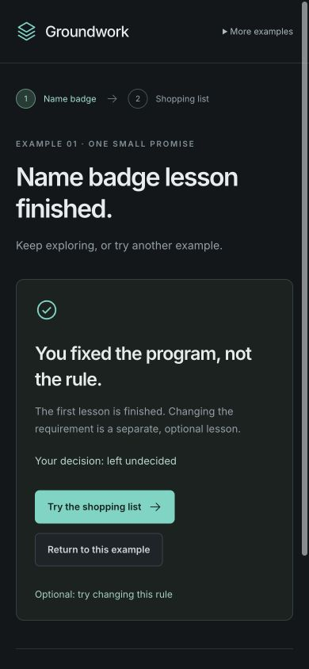
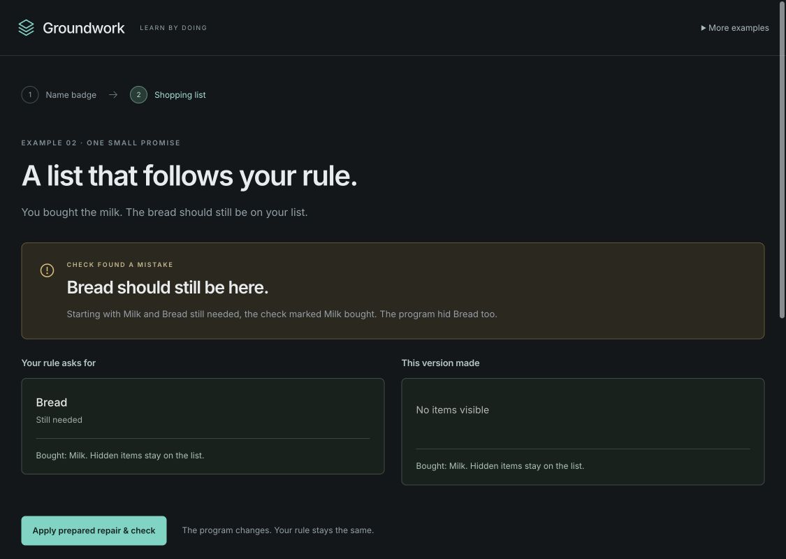
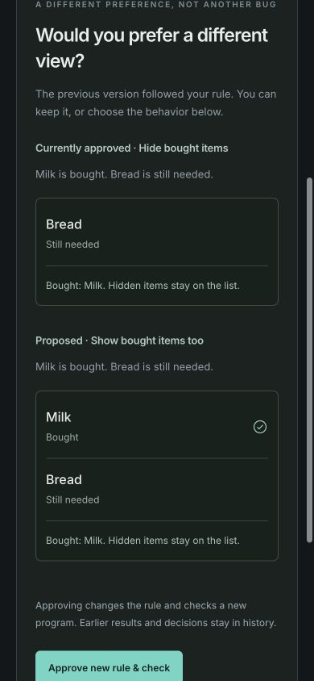

# Groundwork

**Learn how software earns trust. Then make something of your own.**

Choose what a program should do, see it get something wrong, and apply a prepared repair. Then try changing the rule itself. Groundwork keeps the rule, program, check result, and your decision separate.

After the short lessons, create a pattern postcard, memory game, branching story, or tiny garden. Start with something working, personalize it, check its rules, and download the result.

This is an early educational preview, not a general-purpose verifier or AI coding service.

**[Try Groundwork live](https://groundwork-queue-lab.scasella91.chatgpt.site)** · [Source](https://github.com/scasella/groundwork) · [CI checks](https://github.com/scasella/groundwork/actions/workflows/ci.yml)

Use it as a guest, or open **Sign in with ChatGPT** for a separate local workspace.

## Four things to make and keep

Open **More to make → Starter projects**, finish the shopping lesson, or [go directly to the starter shelf](https://groundwork-queue-lab.scasella91.chatgpt.site/?studio=1).


### Pattern Postcards

Color a small half-tile, choose four inks, and compare mirror with half-turn symmetry. The full postcard updates immediately. The check compares all 64 tile cells with an independent rule, then decodes and compares all 1,024 exported SVG cells. Save SVG artwork, a printable HTML page, and editable settings.


### Match My World

Pick four symbol pairs and a color mood, then play your own eight-card memory game. A mismatch waits for **Next turn**, so there is no timer to race. The finite check explores every reachable state of the chosen board. Download a standalone HTML game.


### Your Tiny Adventure

Rewrite five filled-in scene cards, name the choices, and choose their destinations. Every forward route ends within two choices. Let readers go Back, or ask them to start over. Download a playable story with your words and navigation rule.


### Tiny Impossible Garden

Name three creatures, choose their growth families, and water them through three stages. Use unlimited water or three shared drops per manual turn. Nothing withers. Download a little browser toy.


### Keep the evidence with the version

Checking records the settings you chose. Keeping a checked version is a separate, optional decision after trying it and reading the limits. Changing settings creates an unchecked draft; earlier passes and decisions remain historical. Exact HTML/SVG exports are snapshotted with each new check, so a historical download retains the bytes that were checked.


The projects also work on a narrow screen, with shortcuts between playing, editing, and checking.


### Use the result outside Groundwork

Open a downloaded HTML file in a browser. Its program, artwork, and icons are embedded; it needs no server, account, API key, or network. Play starts over when reopened. Pattern HTML is a print page, not a portable editor. An **editable project JSON** can be reopened in Groundwork as a new unchecked draft; it never imports another person's check or acceptance.


These starters use prepared building blocks. They do not force a planted defect, a change of preference, or an acceptance decision into every creative project.

## Critical paths, in pictures

### 1. Choose a rule you can see

Start with fictional Maya Chen. Choose first name or full name and review the exact badge before approving the rule.


### 2. Inspect an actual computed mistake

The prepared faulty formatter reads the wrong field. The checker compares its real output with an independent expected answer: **Maya** was requested, but **Chen** was produced. This is a reproducible result, not a staged failure screen.



Use **Apply prepared repair & check** to replace the program while keeping the same rule. Try another fictional person after the check passes. The sample runs the same stored module that was checked.



### 3. Change your mind without calling correct code a bug

The optional second lesson compares first-name and full-name badges for two people named Maya. Review the old and proposed output together. **Keep my rule** is a valid decision; choosing a new rule requires a new check.



### 4. Finish without being forced to accept

A completed check, an accepted version, and a finished lesson are different things. You can leave the version undecided and still finish. The next step offers the more interactive shopping list.



### 5. Try the shopping list

The promise is simple: after buying Milk, hide Milk but keep still-needed Bread visible. Nothing is actually purchased, and hiding an item does not delete it.


### 6. Reproduce and repair the disappearing-Bread defect

The first filter hides both items. Compare the expected remaining Bread with the empty actual result, then apply the prepared repair and try the list yourself.



The repaired program keeps Bread visible. The interactive controls also ignore the second pointer click in a double-click, so a moving button cannot accidentally buy the next item.


### 7. Review a new shopping preference

Would you rather see bought items too? The optional comparison shows the same shopping state under both rules before approval. The new program receives fresh evidence; old results remain in history.



### 8. Inspect source, history, and scope when you need them

Expand **What was checked? Source & history** for exact source, per-case expected/actual outputs, revisions, and past decisions. Earlier checks can remain **passed** while becoming **stale** for the current version. Export both lesson histories or download the exact module. Each example can be restarted independently after confirmation.

The original **audio queue** remains under **More to make**, or at `/?example=audio`; its saved workspace is separate from the beginner lessons.

## Run locally

Use Node **24.21.0** (the version in `.nvmrc`) or another compatible version from `package.json`.

```sh
npm ci
npm run dev
```

Open the local address printed by Vite. The development server binds to loopback by default. For a production build:

```sh
npm run build
npm run preview -- --host 127.0.0.1
```

No API key, AI subscription, or database is needed. Fonts are bundled through npm rather than fetched from a font CDN.

## What the checks establish

- Badge: exact outputs for four supplied fictional people under the selected rule.
- Shopping: all four bought/not-bought states, four view outputs, and eight enabled transitions.
- Audio queue: finite sequential A/B reachability for capacities 1–6 and two overflow policies.
- Starters: chosen pattern cells and SVG fidelity, memory-game state transitions, bounded story navigation, or discrete garden growth/resource rules.

The sample and checker execute the same stored JavaScript artifact. Expected answers are evaluated separately. Results identify their rule, source, checking conditions, and scope. Earlier results stay inspectable and may become stale.

These are genuine computed checks using **prepared templates and repairs**. There is no live AI agent, arbitrary code import, independent proof kernel, or production-readiness guarantee. The runtime, generator, checker, and reference rules/tables are trusted. Data checks do not establish rendering, accessibility, concurrency, hardware timing, or correctness outside the declared domain. See [architecture and trust boundaries](docs/architecture.md).

## ChatGPT sign-in on Sites

The hosted Sites edition supports optional **Sign in with ChatGPT**, using the platform’s own sign-in and sign-out routes. No password, API key, or app-owned OAuth token is stored by Groundwork. The app does not receive your ChatGPT conversations.

Signing in opens separate projects and lesson progress **on this browser**. Guest progress remains available after signing out. Progress is not synced across devices, and local history remains editable and unsigned. On standalone static hosting or local Vite preview, the account option is unavailable and the app works as a guest.

For a Sites deployment, set the non-secret runtime variable `GROUNDWORK_CHATGPT_AUTH=enabled`. Enable it only behind the Sites dispatcher, which supplies the authenticated-user headers. The included optional Worker endpoint must not trust client-supplied identity headers on a generic hosting platform.

## Your data

Progress is local to this browser and origin. Export before clearing browser data or moving to another address. Each beginner example can be restarted independently after confirmation; the audio example has its own stored session. Invalid saved data is preserved for recovery instead of silently overwritten.

Exports and source downloads are available in the app. Starter editable-project files import settings only. Full workspace/lesson history exports are not currently importable. Browser-local history is editable and unsigned; SHA-256 identifies artifacts, not an authenticated audit trail. See [security and privacy](SECURITY.md).

## Development

```sh
npm run check
npm run verify:release
npm audit
```

`check` runs integrity tests, UI tests, production build, and Sites packaging tests. [Contributing](CONTRIBUTING.md) describes the supported workflow. [Release validation](docs/release-validation.md) distinguishes automated tests, simulated-persona UAT, and remaining gaps.

The build emits `dist/client/` for static hosting and a small Worker package in `dist/server/`. The included `.openai/hosting.json` is deliberately unconfigured. Configure your own hosting project before a Sites deployment; no deployment is performed by installation or tests.

## Status and license

Early preview: **0.2.0-rc.1**, available under the [MIT License](LICENSE). Third-party packages retain their own licenses; see [notices](THIRD_PARTY_NOTICES.md).
