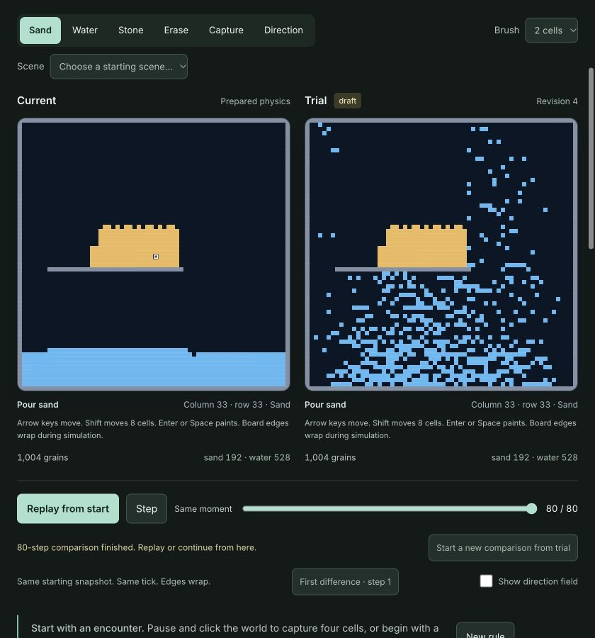
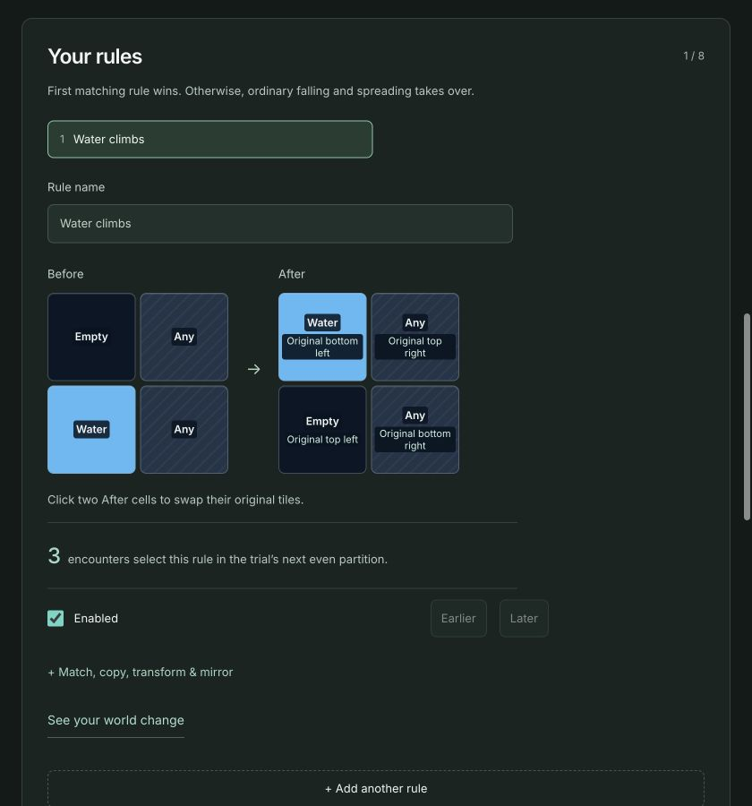
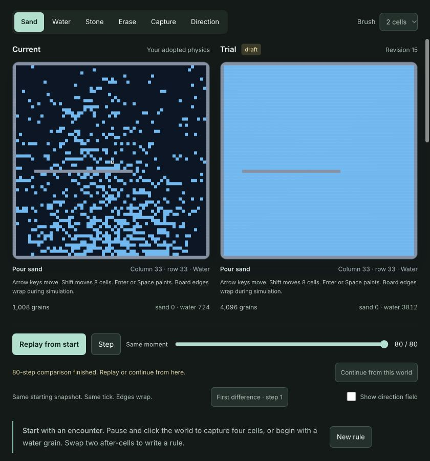
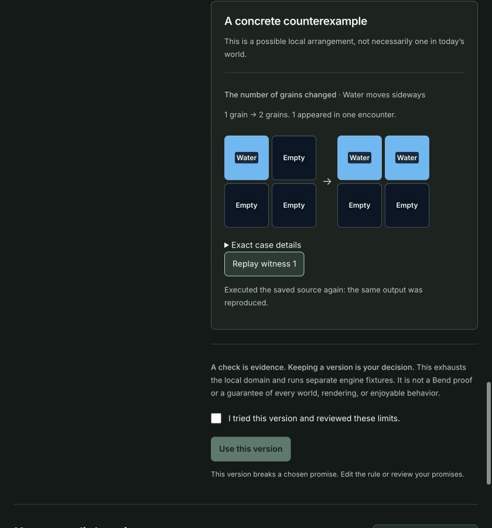
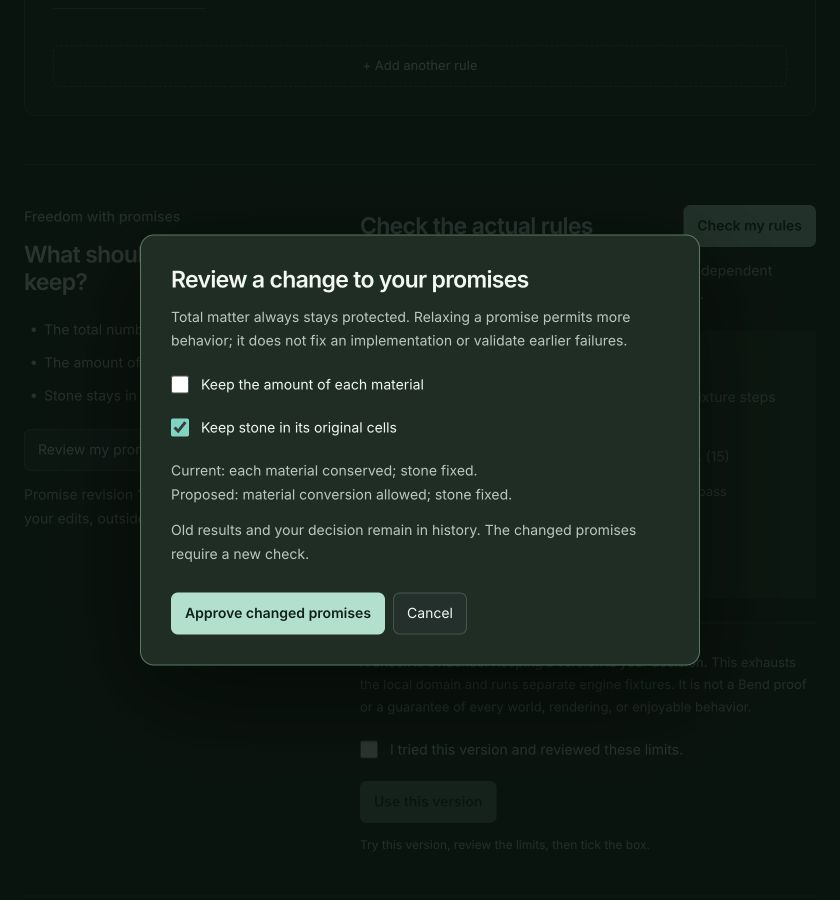
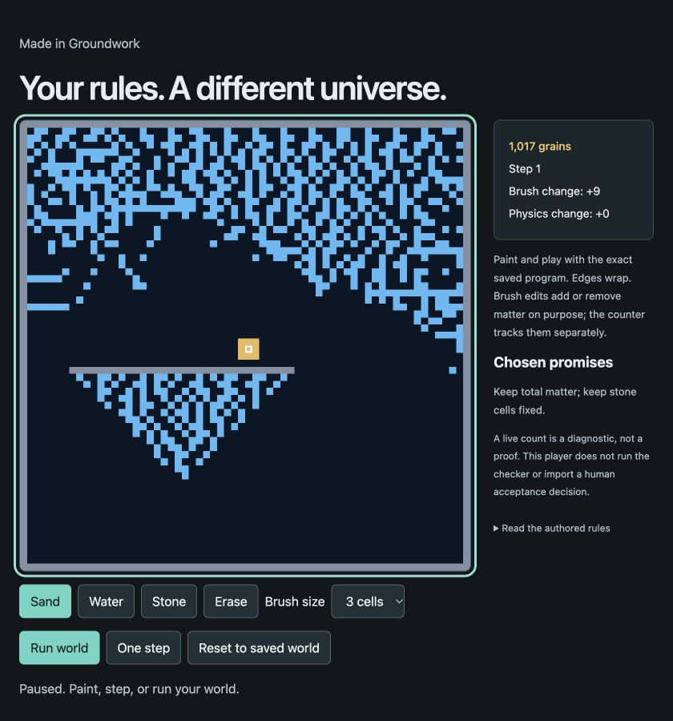
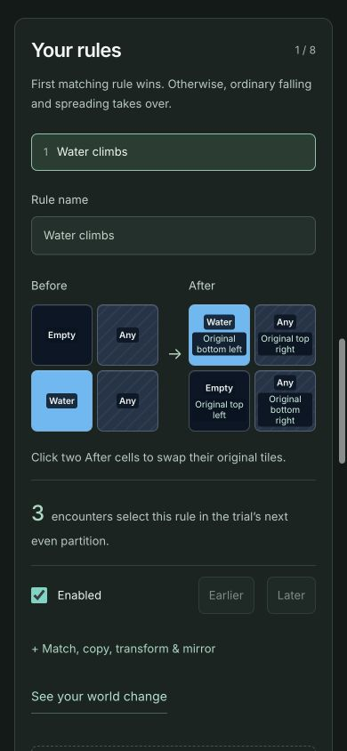

# Groundwork

**Paint a world. Rewrite how it moves. Decide what must stay true.**

Groundwork is a small creative programming workshop. Sand can rise. Water can change direction. One tiny rule can change the whole scene. The checker helps you protect its matter count and any other supported promises you choose.

**[Open the universe workshop](https://groundwork-queue-lab.scasella91.chatgpt.site/?studio=1)** · [Beginner lessons](https://groundwork-queue-lab.scasella91.chatgpt.site/) · [CI](https://github.com/scasella/groundwork/actions/workflows/ci.yml)



The workshop draws inspiration from Tiny Universe's editable physics and protected laws, and from the idea of exploring alternate futures. It is an independent browser implementation. **It does not run Tiny Universe's native Bend proofs, a GPU workload, or live AI generation.** You author the rules; the app creates and executes a precise program from them.

## Invent local behavior

Start with the running world and pour some sand or water. Choose **Change the physics** for a useful starting interaction, or use **Capture** to inspect an encounter in your actual world.

In the rule's **After** picture, click two cells to swap where their contents go. For the first upward-water rule, swap the empty top-left cell with the water below it. The other cells stay as they were.



Your rule runs wherever its before-picture matches. Add more interactions, change their priority, match any material, restrict directions, mirror patterns, copy cells, or transform materials. Up to eight rules combine with the prepared falling/spreading behavior. Direction-field painting changes their frame of reference. Blank, basin, and hourglass starting scenes let you keep exploring with the same physics.

The rules are expressive enough to be wrong for your chosen promises. The editor does not make every possible edit safe by construction.

## Compare two actual futures

Current and trial physics run from **the same starting snapshot**. Pause, step, scrub through 80 updates, or jump to their first difference. The trial uses your proposed source; your kept program remains available. Starting a new comparison from a trial snapshot is an explicit scene change, not adoption of its program.

Here, an authored copying rule turns one water cell into two. The current program retains 1,008 grains; the trial fills every cell. Both views are actual executions at the same step.



## Let the checker find the consequence

**Check my rules** executes every supported local arrangement and context. A failure produces an actual input/output witness. Replay it through the saved source, inspect the responsible rule, and choose what to change.



Copying can be repaired into movement: leave the original position empty instead of retaining both copies. The code changes; the promise stays the same. A fresh check must support the new revision.

A different choice is deliberate alchemy. Turning sand into water preserves total matter but violates a promise to preserve each material. **Review my promises** shows the current and proposed protections before approval. This changes the claim, not the past result. Old failures and decisions remain historical, and the new claim needs fresh evidence.



Checking and adopting are separate. **Use this version** keeps the displayed trial world and its exact program after you review the result and limits. A rejected or unfinished check cannot adopt a proposal.

## Keep what you made

Download an interactive **HTML universe** that runs independently, or an **editable JSON project** to continue in Groundwork. The player embeds the exact source, starts from your saved world, and supports painting, stepping, running, and reset without a server or account.



The workshop supports narrow screens, keyboard world editing, and direct navigation between the world, rules, and evidence.



Each kept version retains its exact HTML bytes. Editable imports contain settings and a drawing, never someone else's source, evidence, or acceptance. Full-history backups are inspectable exports, not currently importable. Saved work is local to this browser and origin; play and brush edits are distinct from program changes.

## What is established

| Evidence | Actual scope |
| --- | --- |
| Exhaustive local check | 256 four-cell arrangements × 4 field directions × 2 partition phases = **2,048 cases** |
| Independent conformance | Stored executable compared with a separately written rule interpreter |
| Chosen invariants | Total occupied-cell count; optionally each material's count and fixed stone positions |
| Whole-engine tests | **15 fixture steps**, including seam and field cases, checked separately |
| Human adoption | A person's decision about the version and its stated limits |

The live world, checker, and exported player use the same identified source artifact. Source, constitution, checker, configuration, revisions, witnesses, and completion are bound into evidence. Stop, refresh interruption, errors, and exhausted budgets remain inconclusive. Edits make affected evidence historical.

**These are finite checks, not a theorem-kernel proof of every world and every tick.** The JavaScript runtime, generator, reference interpreter, and checker remain trusted. Rendering, intent, fun, real fluid behavior, and performance are not proved. A live grain counter is a diagnostic; SHA-256 supplies identity, not a signed audit trail. See [architecture](docs/architecture.md) and [validation](docs/universe-validation.md).

## Existing lessons and work

The [name-badge and shopping lessons](docs/beginner-lessons.md) remain available, alongside the advanced audio queue at `/?example=audio`. They demonstrate implementation repair and requirement revision with their own saved histories.

The former four starter projects are [archived](docs/archived-starters.md). Their saved data has not been deleted; use **Recover archived starter work** in the workshop footer.

## Run locally

Use Node **24.21.0** from `.nvmrc`, or another compatible version declared in `package.json`.

```sh
npm ci
npm run dev
```

Open the printed address with `/?studio=1`. The server binds to loopback. For the production build:

```sh
npm run build
npm run preview -- --host 127.0.0.1
```

No API key or database is required. Fonts and application assets are bundled.

## Accounts and privacy

The hosted Sites edition offers optional **Sign in with ChatGPT** through the platform's own routes. Sign-in opens a separate **device-local** workspace and does not supply model inference or access to conversations. Guest work remains available after signing out. There is no cloud sync, analytics, or application telemetry.

The Sites wrapper uses `GROUNDWORK_CHATGPT_AUTH=enabled` only behind the trusted platform dispatcher. Generic static/local hosting runs as a guest. See [security and privacy](SECURITY.md) before adapting this integration.

## Development and status

```sh
npm run check
npm run verify:release
npm audit
```

The current local gates passed **58 integrity/auth/export tests, 38 UI tests, the production build, and 4 Sites packaging tests**. Browser-operated journeys covered authored changes, counterexamples, both correction loops, actual Stop/refresh interruption, persistence, and standalone downloads. [Validation](docs/universe-validation.md) separates those observations from agent review and unverified human usability.

Early preview **0.3.0-rc.1**. MIT licensed; see [LICENSE](LICENSE), [third-party notices](THIRD_PARTY_NOTICES.md), and [contributing](CONTRIBUTING.md). The build emits a static client and optional Worker package; the public hosting manifest is deliberately unconfigured. Installation and tests do not deploy anything.
