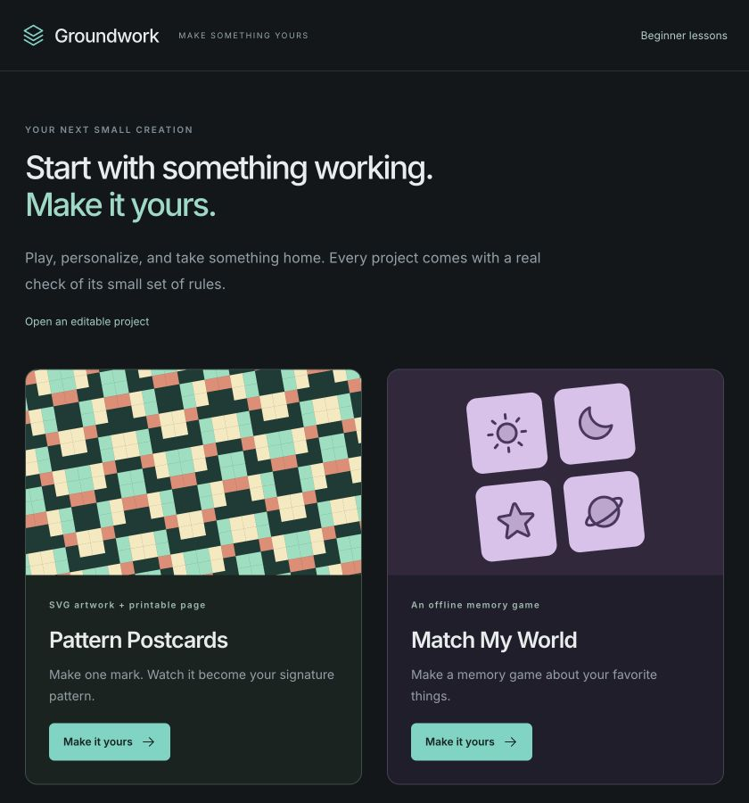
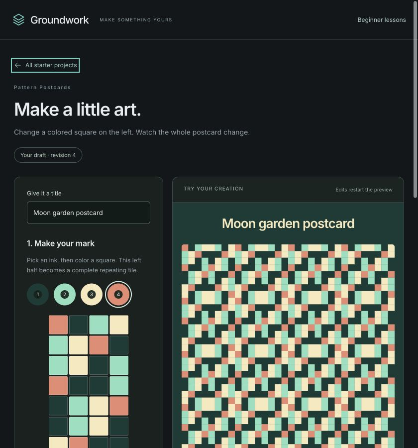
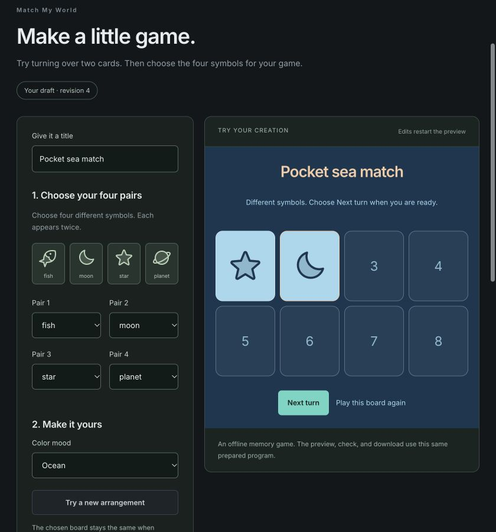
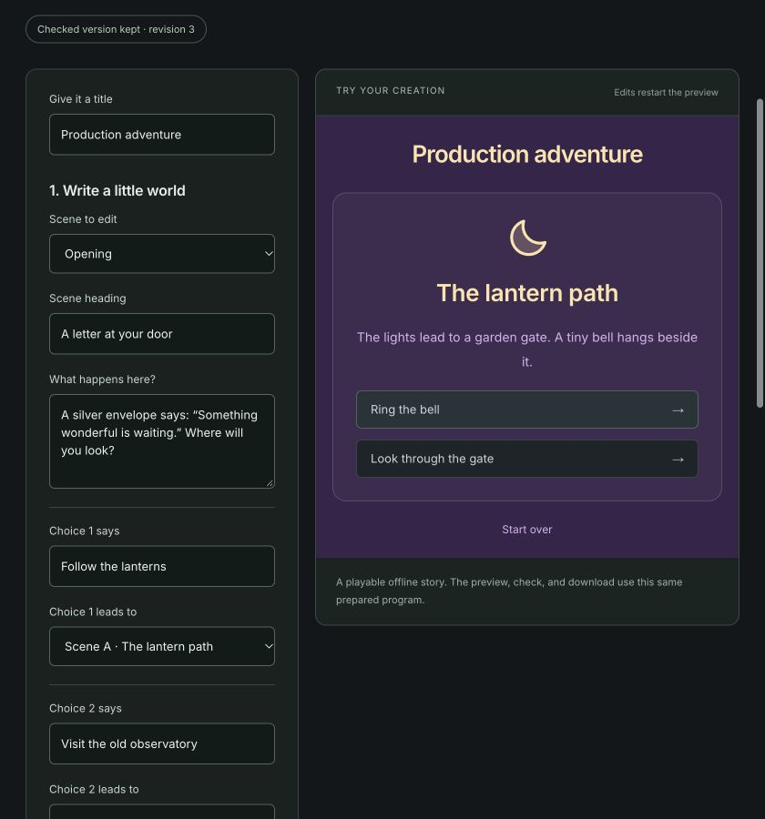
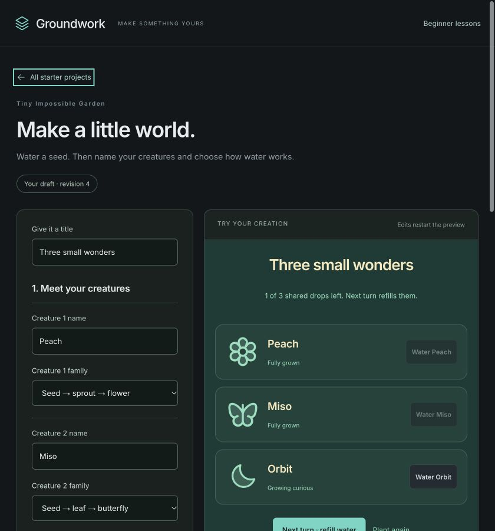
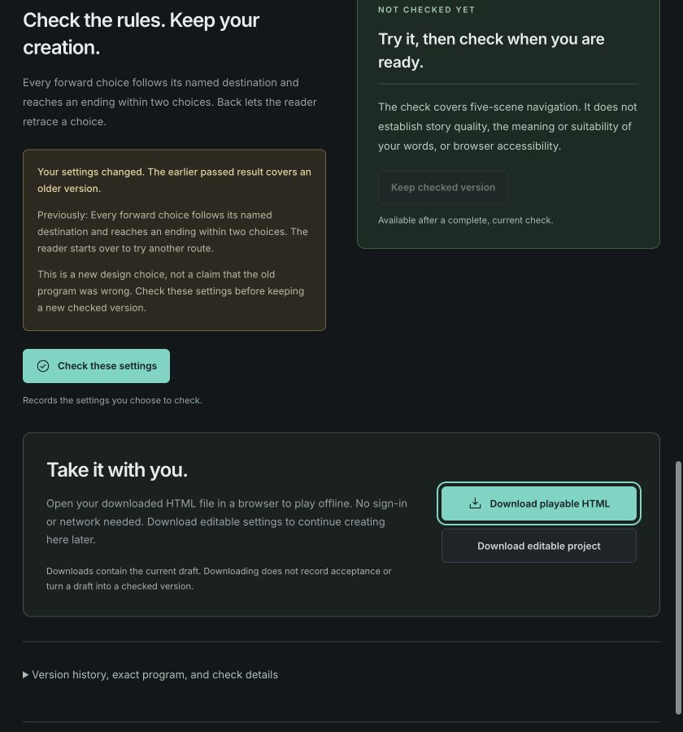
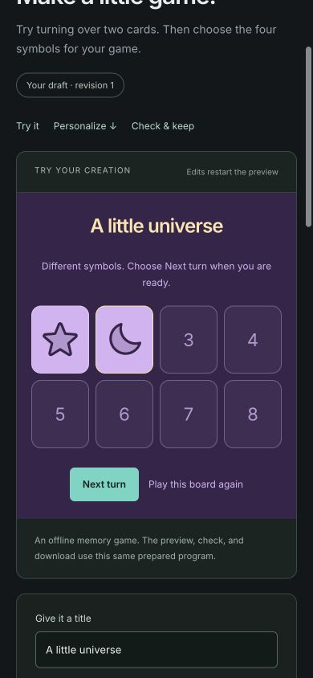
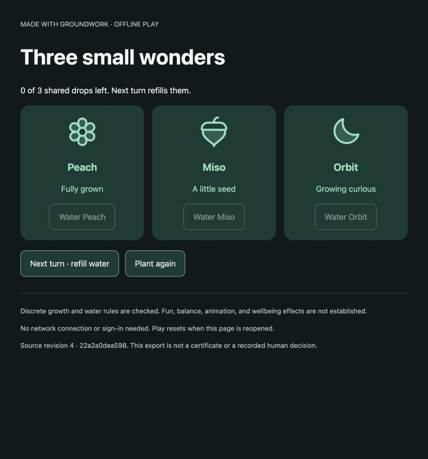

# Archived starter projects

This is the historical 0.2 walkthrough. These four builders are no longer the main creation experience. Existing work is available through **Recover archived starter work** in the universe workshop, or `/?archive=starters`. The current workshop is described in the main README.

## Four things to make and keep

Open **More to make → Starter projects**, finish the shopping lesson, or [go directly to the starter shelf](https://groundwork-queue-lab.scasella91.chatgpt.site/?studio=1).

### Pattern Postcards

Color a small half-tile, choose four inks, and compare mirror with half-turn symmetry. The full postcard updates immediately. The check compares all 64 tile cells with an independent rule, then decodes and compares all 1,024 exported SVG cells. Save SVG artwork, a printable HTML page, and editable settings.

### Match My World

Pick four symbol pairs and a color mood, then play your own eight-card memory game. A mismatch waits for **Next turn**, so there is no timer to race. The finite check explores every reachable state of the chosen board. Download a standalone HTML game.

### Your Tiny Adventure

Rewrite five filled-in scene cards, name the choices, and choose their destinations. Every forward route ends within two choices. Let readers go Back, or ask them to start over. Download a playable story with your words and navigation rule.

### Tiny Impossible Garden

Name three creatures, choose their growth families, and water them through three stages. Use unlimited water or three shared drops per manual turn. Nothing withers. Download a little browser toy.

### Keep the evidence with the version

Checking records the settings you chose. Keeping a checked version is a separate, optional decision after trying it and reading the limits. Changing settings creates an unchecked draft; earlier passes and decisions remain historical. Exact HTML/SVG exports are snapshotted with each new check, so a historical download retains the bytes that were checked.

The projects also work on a narrow screen, with shortcuts between playing, editing, and checking.

### Use the result outside Groundwork

Open a downloaded HTML file in a browser. Its program, artwork, and icons are embedded; it needs no server, account, API key, or network. Play starts over when reopened. Pattern HTML is a print page, not a portable editor. An **editable project JSON** can be reopened in Groundwork as a new unchecked draft; it never imports another person's check or acceptance.

These starters use prepared building blocks. They do not force a planted defect, a change of preference, or an acceptance decision into every creative project.
