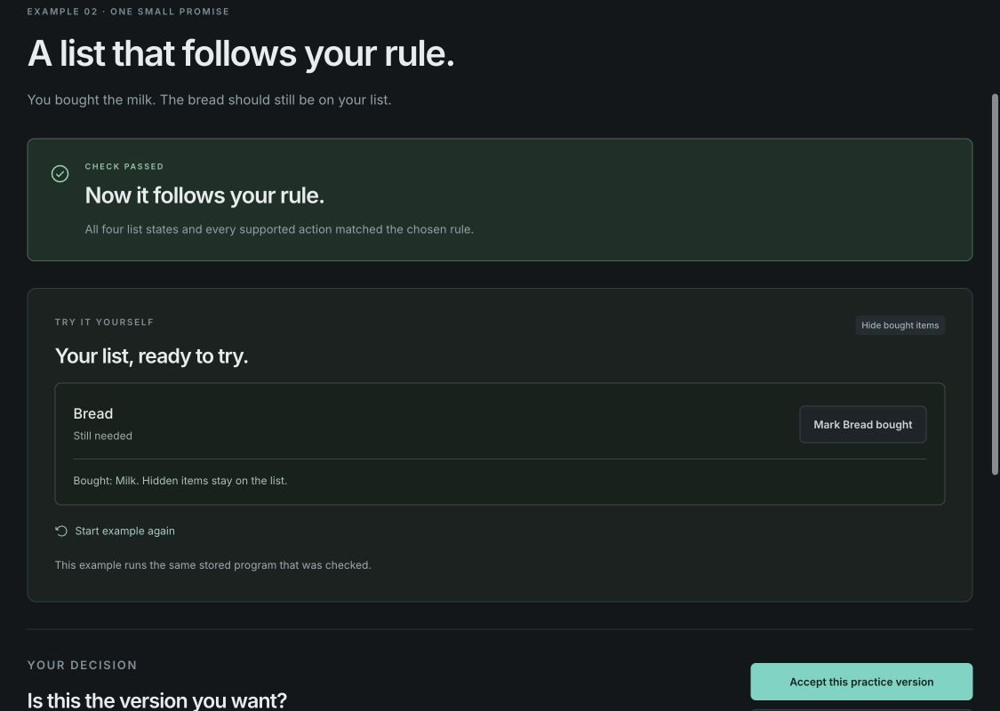

# Current universe-workshop update

The 0.3.0-rc.1 replacement is documented in [universe validation](universe-validation.md). Earlier release records below remain historical.

# Current starter-project update

The 0.2.0-rc.1 four-project update passed 37 integrity/auth tests, 24 UI tests, the production build, and 4 Sites packaging tests. See [starter validation](starter-validation.md) for observed browser journeys, export checks, fixes, and remaining limits. The records below describe earlier release work.

# Release-candidate validation

Candidate: 0.1.0-rc.1. Checked on 2026-09-27. This document describes local evidence, not a production certification.

## Automated gates

On macOS Apple Silicon with Node 24.21.0, including a fresh `npm ci` and the full gate sequence in the sanitized release candidate:

| Gate | Observed result |
| --- | --- |
| `npm test` | 26 integrity tests passed |
| `npm run test:ui` | 15 interaction tests passed |
| `npm run build` | Passed |
| `npm run test:sites` | 4 tests passed, including required build artifacts |
| `npm audit` after compatible fixes | 0 reported vulnerabilities at the time checked |

The audit originally reported five vulnerable packages. Vite was patched from 6.4.2 to 6.4.3 and compatible transitive fixes were applied. See the [Vite advisory](https://github.com/advisories/GHSA-v6wh-96g9-6wx3). Audit results are time-dependent and do not prove absence of vulnerabilities.

The initial licensed candidate content scan passed for 38 staged/tracked files; its allowlisted copy removes local-only histories, machine paths, and hosting identity.

The pinned CI workflow targets Node 22.22.2, 24.21.0, and 26.8.1 on GitHub-hosted Linux. The initial README/CI-fix commit passed that hosted matrix; later changes require their own run. The account integration has local unit and interaction coverage, with the live OAuth redirect owned by Sites. Local verification does not establish Windows, Linux, every browser, or every engine-version combination.

## Adversarial review and simulated-persona UAT

Three independent Astra agents used different perspectives: impatient novice, cautious keyboard-oriented coordinator, and skeptical source/security maintainer. The two UI reviewers used isolated local production-preview origins. They were not real human study participants.

Observed working paths included both beginner repair/revision loops, finishing undecided, keeping a rule, separate acceptance, persistence, historical current/stale results, source/export access, reset cancellation, scoped reset, and the round-trip to the preserved audio example.

Confirmed defects and resolution:

1. Malformed stored decisions, primitive display data, legacy migration, and active-run revision fields could reach React and crash outside recovery. Shape validation now rejects these before rendering and preserves originals. Six original render fixtures were independently rerun and reached recovery. The legitimate capacity+1 overflow demonstration still restores.
2. Double-clicking Mark Milk bought could also mark Bread bought when the next button moved under the pointer. The second pointer click in a multi-click sequence is now ignored for purchase actions. The coordinator repeated the original native-browser sequence twice: Bread stayed needed and visible. A separate single click and an Enter-key purchase still worked. The original reviewer could not perform their own post-fix browser retest because that subagent's browser became unavailable; this is explicitly coordinator verification.
3. Repeated advanced acceptance could append duplicate decisions. Acceptance for the same current result is now idempotent.

## Evidence limits

These reviews are bounded adversarial checks. They do not establish human comprehension, accessibility compliance, general software verification, or security against every input. Full accessibility-tree access can make simulated novices more capable than visual-only first-time users. Screenshot cropping seen by the reviewers was traced to a capture/viewport mismatch rather than measured page overflow; the coordinator recaptured the fixed state at a controlled viewport.

The application trusts JavaScript, its prepared templates, the reference data/rules, and the checker. Browser-local history is editable. Exact-template restrictions may require recovery/export after incompatible future template changes. The public candidate excludes private review records, local exported sessions, absolute machine paths, and the original hosting project identifier.

The maintainer approved publication under the MIT license. The local evidence above does not itself establish remote CI success; consult the repository’s Actions page for current runs. Publishing this source does not deploy a hosted application.

## Publication and hosting

The MIT-licensed repository and illustrated README are public. The [live Site](https://groundwork-queue-lab.scasella91.chatgpt.site) was deployed successfully through Sites with its existing public audience and native ChatGPT sign-in integration enabled. Local account tests cover header handling, separate guest/account keys, safe return paths, account-switch revalidation, and failure behavior. No manual end-to-end OAuth login or account-security penetration test is claimed.

The hosted Node 22/24/26 CI matrix passed for the account-revalidation implementation. See the repository Actions page for the current main/release status.
